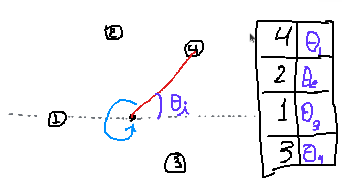

# Perimeter

Algoritmo para desenhar um polígono dado um conjuntos arbitrário de pontos na tela. 

## O algoritmo 

Imagine um ponteiro de relógio grande o suficiente para alcançar qualquer ponto na tela. Ao girar o ponteiro, no sentido horário ou anti-horário, você poderá ordená-los. 

1. Encontre o ponto médio dos pontos na tela;
1. Para cada ponto da tela, calcule o ângulo da diferença entre o ponto médio da figura e o ponto atual em relação a uma linha horizontal;
1. Ordene os pontos em relação ao ângulo calculado; 
1. Percorra os pontos ordenados ligandos os pontos; 



## Implementação

```python
def stroke(self, surface):
    figure_center = self.get_center()

    def angle(point):
        return math.atan2(
            point.y - figure_center.y, 
            point.x - figure_center.x
        )

    vertices = [ vertex.center for vertex in self.vertices ]

    vertices.sort(key = angle)
    
    vertices_len = len(vertices)

    for i in range(vertices_len):
        start = vertices[i]
        end = vertices[(i + 1) % vertices_len]

        pygame.draw.aaline(
            surface,
            random.choice(self.line_colors),
            (int(start.x), int(start.y)),
            (int(end.x), int(end.y))
        )
```

## Demonstração

Veja o vídeo demonstração [aqui](./assets/figure.mp4).

## Como executar na sua máquina?

Você precisará instalar o [poetry](https://python-poetry.org/) caso não tenha.

Clone o repositório 
`git clone https://github.com/pab-h/perimeter`

Execute no respositório clonado 
`poetry init`

Execute o arquivo main.py 
`poetry run python perimeter/main.py`

## Comandos

`space`: Desenha as linhas entre os pontos na tela;
`click`: Coloca um ponto da tela; 

## Implicações

Utilizando o mesmo método, é possível ordenar os pontos de um poligono. 